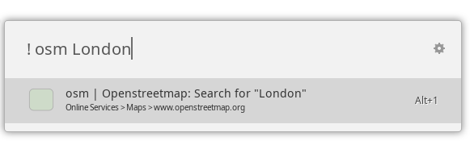
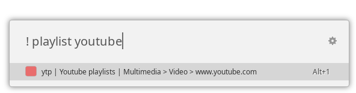

# DuckDuckGo Bangs for Ulauncher

This is a extension for [Ulauncher](https://github.com/Ulauncher/Ulauncher) that allows you to browse and use [DuckDuckGo bangs](https://duckduckgo.com/bang). DuckDuckGo bangs are a collection of keywords (called "bangs") that let you access the search of thousands of website's directly. E.g., `gi` is the keyword for Google's image search and when you type `! gi ulauncher`, you are directly taken to the Google image search for `ulauncher`. 

The idea of this extension is:

1. Directly **use** the bangs from within ulauncher. You will straightforward go the site, i.e. no extra request is made to DuckDuckGo, which makes it faster to use them. Note that you need to put a space between the `!` and the bang. E.g., you can open the OpenStreetMap search for `London` by typing `! osm London`:

2. Offer a **search** for the available DuckDuckGo bangs. If you don't remember the keyword for a site, you can search for all bangs that are available. For example, if you want to lookup if there's a bang that can search for playlists on youtube:

You can also access the DuckDuckGo search with this extension, by using the bang `! ddg`.

# Installation

Go to the extensions tab of Ulauncher's settings, click on 'Add Extension', and enter the name of this repository: `https://github.com/dhelmr/ulauncher-duckduckgo-bangs`.

By default, the extension can be started with the keyword `!`, followed by a space and either a DuckDuckGo Bang, or a search term that will be used for browsing the available websites.

Have a look at [the Ulauncher page](https://ext.ulauncher.io/) for more information about extensions and how to install them.

# Requirements

You need Python 3.7 and Ulauncher >= 5 (Extension API 2.0).

# How does it work?

The information for the bangs can be downloaded from [DuckDuckGo as a JSON file](https://duckduckgo.com/bang.js), and this is what the extension does in the background. It then uses this information (the bang keywords, names, categories and urls) to show you the list in Ulauncher. 

By the extension no requests to DuckDuckGo are made: When you type `! w Linux`, the Web Browser will directly go to `https://en.wikipedia.org/wiki/Special:Search?search=Linux` and not first open a DuckDuckGo search with `!w Linux`. In this manner using the bangs from this extension is potentially faster than from DuckDuckGo.

# Known issues

* Combining `&` and html special characters (like `<` or `>`) will result in an empty result item. [See here](https://github.com/Ulauncher/Ulauncher/issues/477) for more information. The item can selected however and the underlying action, e.g. opening the url, will work too.

# License 

[Licensed under GPLv3](LICENSE.txt). The duckduckgo icon is separately licensed under [CC BY-NC-ND 4.0](https://creativecommons.org/licenses/by-nc-nd/4.0/), by [DuckDuckGo](https://duckduckgo.com/).
